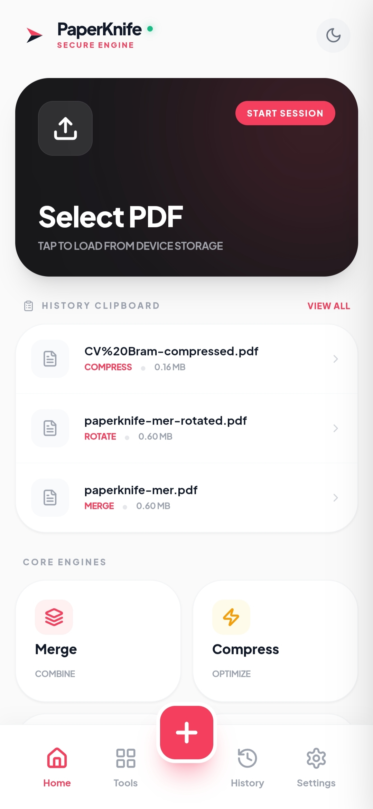

<p align="center">
  
</p>

# PaperKnife

**A simple, honest PDF utility that respects your privacy.**

[](LICENSE)
[](https://github.com/Ankitkumar7217734/PaperKnife/stargazers)
[](https://ankitkumar7217734.github.io/PaperKnife/)
[](https://github.com/Ankitkumar7217734/PaperKnife/releases/latest)

## Download Android APK

[](https://github.com/Ankitkumar7217734/PaperKnife/releases/download/v1.1.0/paperknife-debug-v1.1.0.apk)

> **Direct link:** https://github.com/Ankitkumar7217734/PaperKnife/releases/download/v1.1.0/paperknife-debug-v1.1.0.apk
>
> Or browse all versions on the [Releases page](https://github.com/Ankitkumar7217734/PaperKnife/releases/latest).

---

## Preview

<p align="center">
  
  
</p>

---

## Why PaperKnife?

Most PDF websites ask you to upload your sensitive documents—bank statements, IDs, contracts—to their servers. Even if they promise to delete them, your data still leaves your device and travels across the internet.

PaperKnife solves this. Every tool runs entirely in your browser or on your phone. Your files never leave your device, they aren't stored in any database, and no server ever sees them. It works 100% offline.

## Tools

**21 tools, all running locally on your device:**

### ✏️ Edit
*   **Merge PDF** — combine multiple PDF files into one document.
*   **Split PDF** — visually extract specific pages or ranges.
*   **Rotate PDF** — fix page orientation permanently.
*   **Rearrange PDF** — drag and drop pages to reorder them.
*   **Page Numbers** — add numbering to your documents automatically.
*   **Watermark** — overlay custom text for branding or security.
*   **Signature** — add your electronic signature to any document.
*   **N-Up Pages** — place 2, 4, or 6 pages onto one sheet for printing.

### ⚡ Optimize
*   **Compress PDF** — reduce file size with different quality presets.
*   **Compress Image** — shrink image size and resize to required dimensions.
*   **🆕 Increase PDF Size** — pad a PDF up to an exact target size in KB or MB, to meet minimum upload requirements. The document opens exactly as before.
*   **🆕 Increase Image Size** — pad an image up to an exact target size in KB or MB.
*   **Grayscale** — convert all document pages to black and white.
*   **Repair PDF** — attempt to fix corrupted or unreadable documents.

### 🔒 Secure
*   **Protect PDF** — encrypt your documents with a password.
*   **Unlock PDF** — remove passwords from your protected files, locally.
*   **Metadata** — view and clean document properties (Author, Producer, etc.) to keep your files anonymous.

### 🔄 Convert
*   **PDF to Image** — convert document pages into high-quality images.
*   **Image to PDF** — turn JPG, PNG, and WebP files into a professional PDF.
*   **Extract Images** — pull out all original images embedded in a PDF.
*   **PDF to Text** — extract plain text from your PDFs, with OCR support.

## How to use it

*   **On the Web:** visit the [live site](https://ankitkumar7217734.github.io/PaperKnife/). Use it like any other website, or "install" it as a PWA for offline access. There is also a download button at the bottom of the page for the Android app.
*   **On Android:** download the [APK from the latest release](https://github.com/Ankitkumar7217734/PaperKnife/releases/latest) and install it. If Android warns about an unknown source, allow the install — the app is built automatically from this repository's source code by GitHub Actions.

> **Updating?** Releases are currently debug-signed, so when installing a newer version you may need to uninstall the old app first if Android reports a package conflict.

## Privacy, by design

*   **100% client-side** — no uploads, no servers, no accounts.
*   **Works fully offline** once loaded (PWA + Android app).
*   **No analytics, no trackers, no ads.**
*   **Auto-Wipe** — optionally clears your activity history after a period of inactivity.

## Build from source

```bash
# Web
npm install
npm run dev          # development server
npm run build        # production build into dist/

# Android (requires Android SDK + Java)
npm run build
npx cap sync android
cd android && ./gradlew assembleDebug
# APK output: android/app/build/outputs/apk/debug/app-debug.apk
```

Every push to `main` automatically builds the web app (GitHub Pages) and the Android APKs (GitHub Actions).

## Under the hood

Built with **React**, **TypeScript**, **Vite**, and **Tailwind CSS**. PDF processing is handled by **pdf-lib** and **pdfjs-dist**, OCR by **tesseract.js** (WebAssembly), and the Android version is powered by **Capacitor**.

## Support the project

PaperKnife is open-source, ad-free, and tracker-free.

*   **Give it a Star** ⭐ — it helps other people find the project.
*   **Report bugs** via [Issues](https://github.com/Ankitkumar7217734/PaperKnife/issues).
*   **Spread the word** — share it with anyone who handles sensitive documents.

## Credits & license

This project is maintained by [Ankitkumar7217734](https://github.com/Ankitkumar7217734) and is a fork of [PaperKnife](https://github.com/potatameister/PaperKnife) by potatameister, extended with new tools.

Licensed under the **GNU AGPL v3** to ensure it remains open and transparent forever.
